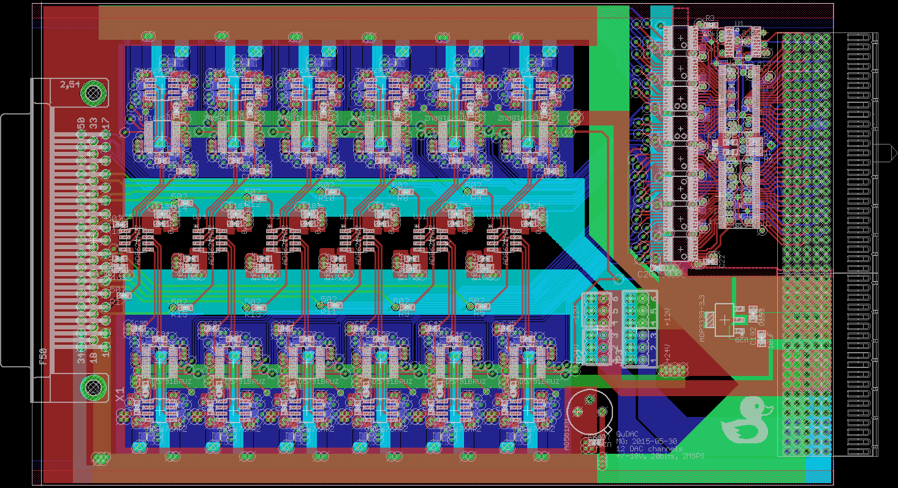

#QuDAC

This is a 12-channel 20-bit, +/-10V (+/-20V optional) 2MSPS DAC board designed for the Quanta rack system (QuACK). The card was designed to meet the system requirements described bellow while also being simple to populate and interface with the experiment chamber. Since we assemble these by-hand, we wanted as few components as possible while still meeting the experiment requirements. All components should be standard and easy to source, and if possible relatively cheap. A huge exception to the cheap criterion was the use of the ad5791 DAC chip, however there is a a slightly cheaper 18-bit ad5781 which is a drop-in replacement. 

We've tested the cards at +/-10V, and have achieved reliable update rates at 2MSPS (above the 1.33MSPS datasheet spec for ad5791). Output slew's of ~50V/us have been measured on voltage swings >1V. Noise output is DAC-code dependent currently limited by the reference-noise (~100nV/sqrt(Hz)). This can be improved by using an adapter reference board with heavy filtering, 3-pole 1.5Hz cut-off RC filter with capacitors in a bootstrap configuration to minimize offset errors, which reduces the white-noise level to that dominated by the DAC and output op-amp of ~10-20nV/sqrt(Hz)

##Layout 

The board contains 6-layers. This was mostly due to a panel order with other designs requiring 6 layers. The board could easily be re-drawn with 4 layers.
The current layout is 

+	layer 1 - analog signals (top)
+	layer 2 - ground plane
+	layer 3 - analog signals
+	layer 4 - power planes
+	layer 5 - ground plane
+	layer 6 - digital signals (bot)

##Application aim 

Trapped ion quantum computing (TIQC) requires dozens of independently controllable voltage sources with low noise (<100nV/sqrt(Hz)), wide-output range (+/-10V) and fast update rates (>1MSPS). These sources should be extend-able while maintaining synchronized updates, and allow for asynchronous clocking. 

###Output range
In the trap for our particular experiment, Sandia's high optical access trap (HOA v2), there are 96 independent control electrodes. With a trapping height ~68micron, an electrode pitch of ~70micron and control electrodes between the RF electrodes the HOA requires voltages of ~1-4V for trapping potentials producing secular frequencies $\omega_{sec} \approx 2\pi 1MHz$. And allows for +/-20V without damage to the on-chip RF-shunting capacitors. 

###Precision

###Noise level
For room temperature traps typical electric field noise at the ion, due to yet-unknown surface effects, is around (insert $S_{\nu} \approx 1$), which corresponds to an electrode-voltage noise of (~nV/sqrt(Hz)). Electric field noise in ion traps is a major concern for high fidelity operations, as current two-qubit gate mechanisms use the ions motional state and are first order sensitive to changes in the motional state during the gate operation. In order for gate fidelities to reach error correcting thresholds of ~1e-4 control-voltage noise must be kept well bellow this value. 

###Update rates
Control potentials used in TIQC is typically a compromise between many different concerns. One such concern is that the electric field noise spectrum typical goes as ~1/f such that increasing the secular frequencies is one way to reduce the error due to motional heating of the ion. Another is trap stability and overall trapping depth, since the axial-potential can easily over-take the radial psuedo-potential and reduce the trapping depth to zero. For the trapping dimensions typical used (heights of 50-150micron) useful compromises tend to be between 1-2MHz axial secular frequencies. 

This sets the time scale how changes to control voltages will affect the ions motion, i.e. the time scale for changes to be adiabatic or diabatic. We would like voltage updates to be on the order of or faster than the characteristic ion motion, so update rates exceeding 1MSPS and slew rates >1V/MHz are necessary to meet this constraint. 

###synchronized updates and clocking
The density of the DAC's per card and the clocking rate. where chosen to meet more general back-plane specifications, which takes into account additional devices of interest, clocking speeds, types of isolation achievable over various clock speeds and bus-size. In the end, a 36-bit backplane bus allows for 12-DAC's with independent sync,clock and data lines. In addition to these 36-bits there are an additional 8-bits which by-pass the card select buffers on the backplane interface, which we connect the DAC update pin (LDAC) to allowing multiple cards to be updated simultaneously. 

#Adapters 

There are 3 adapter cards used in our setup. Which assist in converting the card channels into the experiments two DB-50 connectors. 

##Combine2Cards
The first `Combine2Cards' allows us to combine two of the QuDAC cards into a single 24 channel output. The card can be placed directly on the cards within the rack, designed for accommodate the 7HP spacing of the QuACK system. The pin-out is made such that each control voltage is routed as a twisted pair with a ground wire using standard db50 cables. 

##24CH-2x24CH
The second card, '24CH-2x24CH', copies one 24 channel output into 2 identical pin-out 24-channel outputs. Allowing 48 DAC's to control all 96 trap control voltages. The card also has a 3rd copy for probing voltage outputs.

##filterboard
The final card, 'filterboard', takes two 24-channel inputs and routes them into a single db50-connector. The board also contains 48 7-pole (or 3-pole) coilcraft.com LC filters. In our setup, these are 7-pole 300kHz LC-filters, providing 80db suppression at 1-2MHz. This board is intended to plug directly into the vacuum chamber experiment flange, which routes 100 control signals into the trap-chip through two DB-50 connectors. One of thees boards should also be configured with the resonator-line populated. On our setup, this line consists of a hand-wound ~500nH inductor, connecting to ~20pF trap capacitance producing a ~50MHz resonant frequency, and ~300pF of matching capacitance. The RF tap, consists of a high-voltage 0.2pF capacitor and a 100pF capacitor for a ~1/500 sampling voltage gain. 

#System performance

## range, offset and non-linearity

## noise spectral density

## update rate, slew rate, tone-purity

## synchronous update, clock noise

